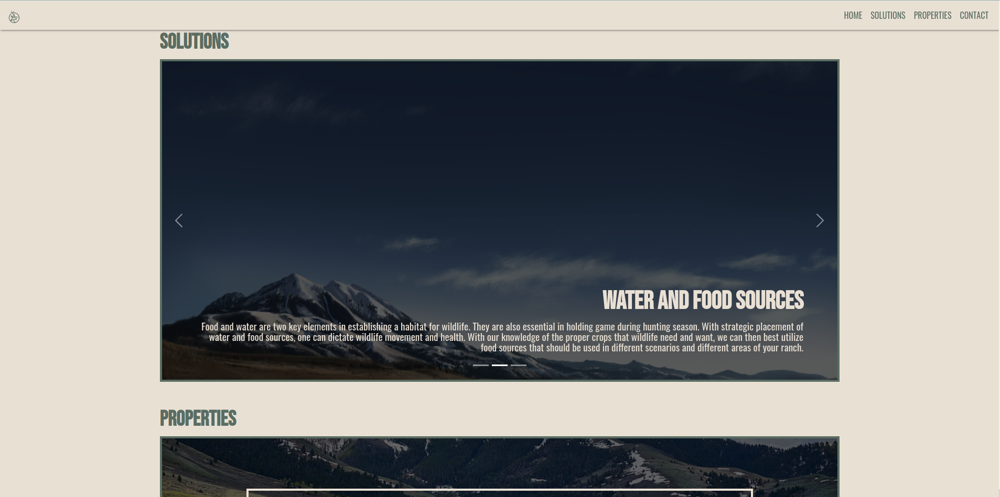
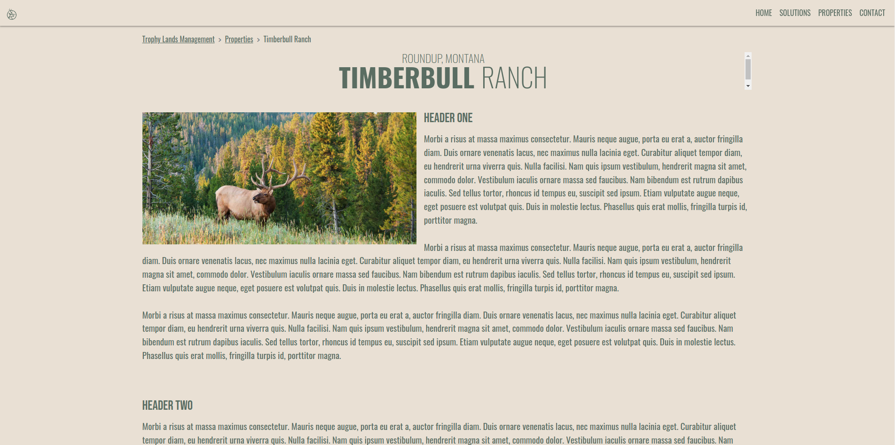
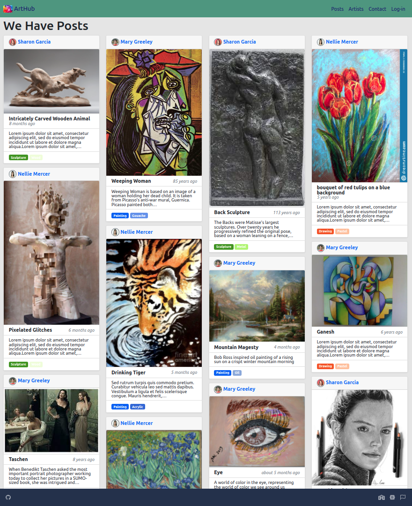
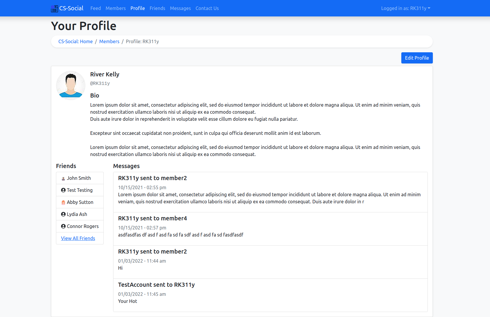

# Hi there :wave:

## GITHUB

## SKILLS

## WEBSITES

### [Trophy Lands Management](https://tlm.rk311y.com/)

---

### [Arthub.com](https://arthub.rk311y.com/)

---

### [LAMP Stack](https://lamp.rk311y.com/index.php/members/view/RK311y)

